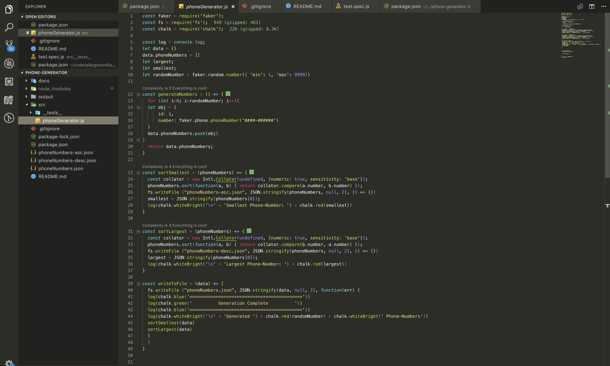

# Random Phone Generator

Node application that Generates Random Phone Numbers.
- It Writes the numbers in 3 files :-
  - 1 - phoneNumbers.json, for all generated numbers.

  - 2 - phoneNumbers-asc.json, for all generated numbers in ascending order based on phone number value.

  - 3 - phoneNumbers-desc.json, for all generated numbers in descending order based on phone number value.

## Getting Started

These instructions will get you a copy of the project up and running on your local machine for development and testing purposes.

#### Prerequisites

What things you need to install the software and how to install them

```
- node
- npm or yarn
```

#### Installing

How to get it running on your local machine.

- Cloning the project.

  * while inside a desired directory, clone the phone-generator repository using https://github.com/kisakyegordon/phone-generator.

- Install Packages

  * enter the phone-generator repository then run the `npm install` or `yarn  install` command on the terminal to install the required libraries.

- Start The Application

  * To start the application, run the `npm start` or `yarn start` commands.


#### Running the tests

To locally run the tests

  * run the `npm test` or `yarn test`, you can also see the whole coverage by appending --coverage ie `npm test --coverage`.


#### How it works.

- After setting everything up, when you start the application with `npm start` or `yarn start`.

  These are the things that happen :-

  1 - Total Number of randomly generated numbers is logged on the console.

  2 - Smallest and Largest generated numbers are logged on the screen with their Id's.

  3 - 3 files are generated ie phoneNumbers.json, phoneNumbers-asc.json and phoneNumbers-desc.json

  
`Logged Information`

  
  `Generated Files`

